# ERD
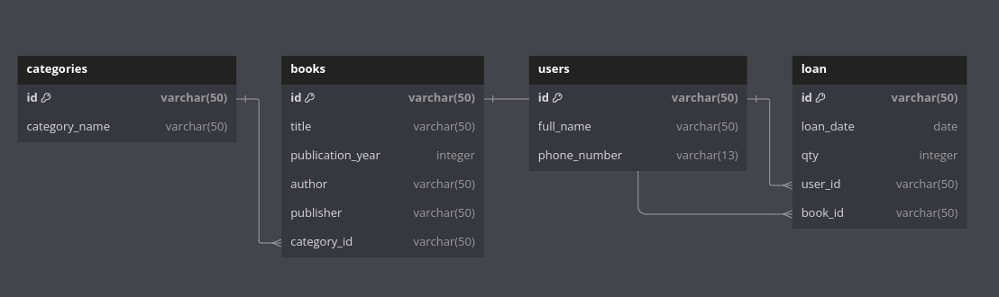
https://dbdiagram.io/d/66be1cd08b4bb5230e3898d4
### ======================================================================
# Testing
## User Option

### 1. Add User
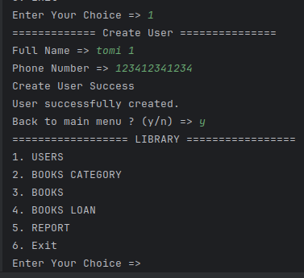
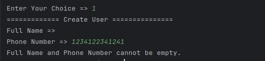
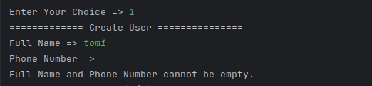
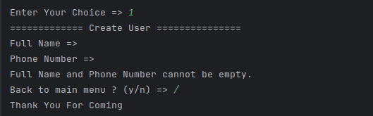
### 2. Get All User
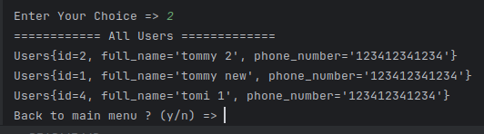
### 3. Get User By id
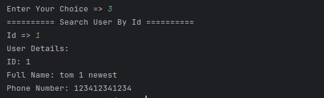
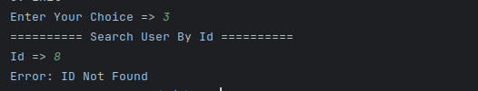

### 4. Delete User
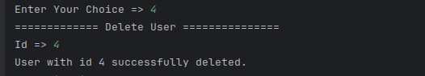
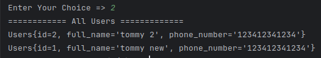
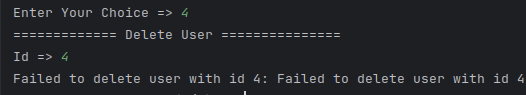
### 5. Update
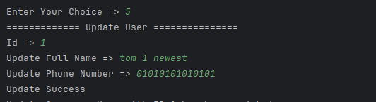
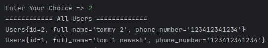
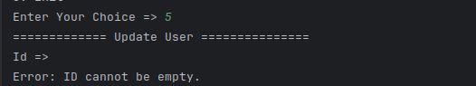
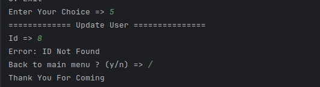
### 6. Exit
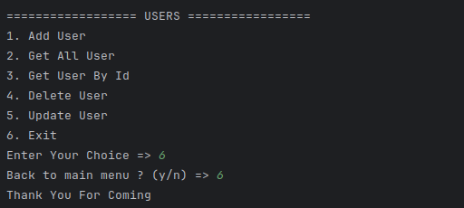
### 7. Wrong input
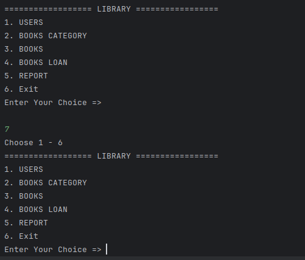
### ======================================================================

## Books Category Option
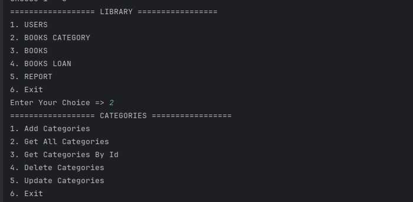
### 1. Add Categories
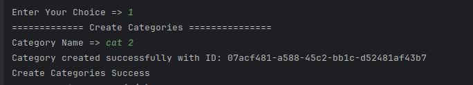
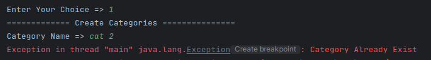
### 2. Get All
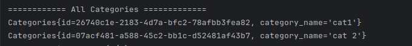
### 3. Get By Id
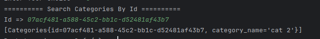
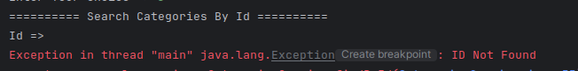
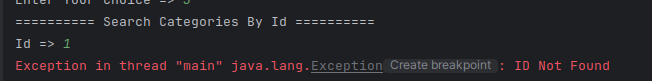
### 4. Delete
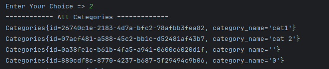
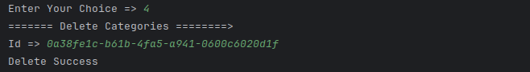
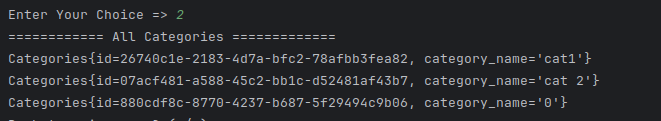
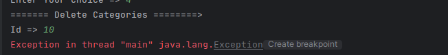
### 5. Update
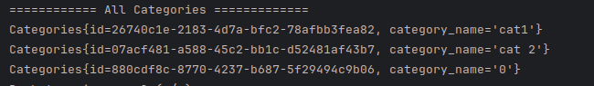
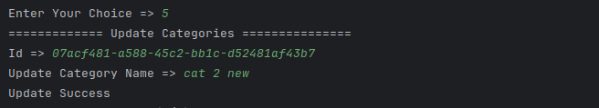
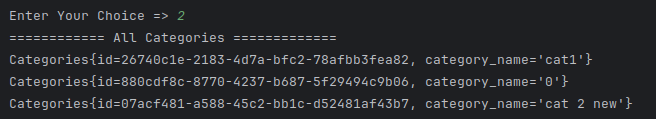
### 6. Exit
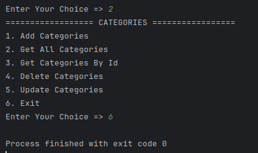
### 7. Wrong input
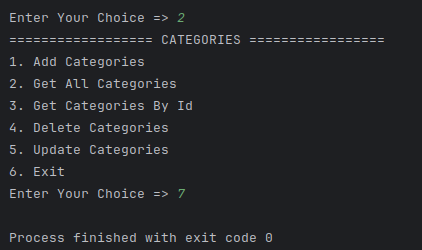
### ======================================================================

## Books

### ======================================================================

### ======================================================================
for me
going in to database
psql -U postgres -h localhost

