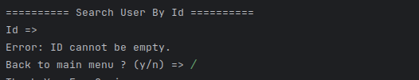

# Testing
## User Choice

### 1. Add User

### 2. Get All User

### 3. Get User By id

### 4. Delete User

### 5. Update

### 6. Exit

### 7. Wrong input

for me
going in to database
psql -U postgres -h localhost

