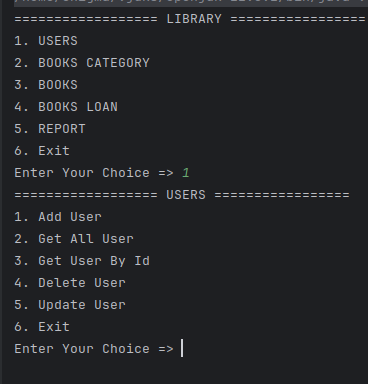

# ERD

https://dbdiagram.io/d/66be1cd08b4bb5230e3898d4
### ======================================================================
# Testing
## User Option

### 1. Add User

### 2. Get All User

### 3. Get User By id

### 4. Delete User

### 5. Update

### 6. Exit

### 7. Wrong input

### ======================================================================

## Books Category Option

### 1. Add Categories

### 2. Get All

### 3. Get By Id

### 4. Delete

### 5. Update

### 6. Exit

### 7. Wrong input

### ======================================================================

## Books

### ======================================================================

### ======================================================================
for me
going in to database
psql -U postgres -h localhost

